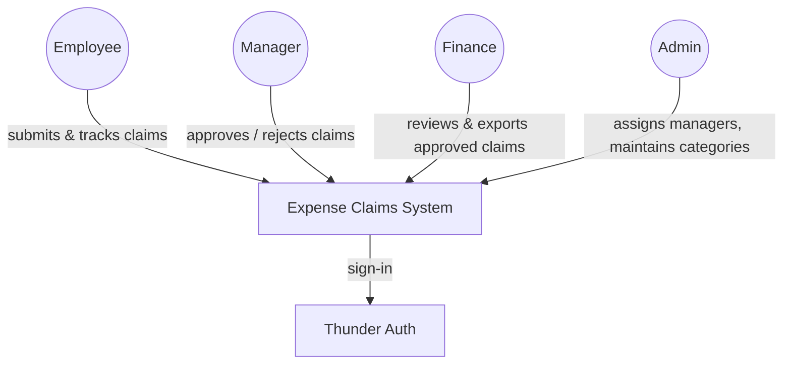
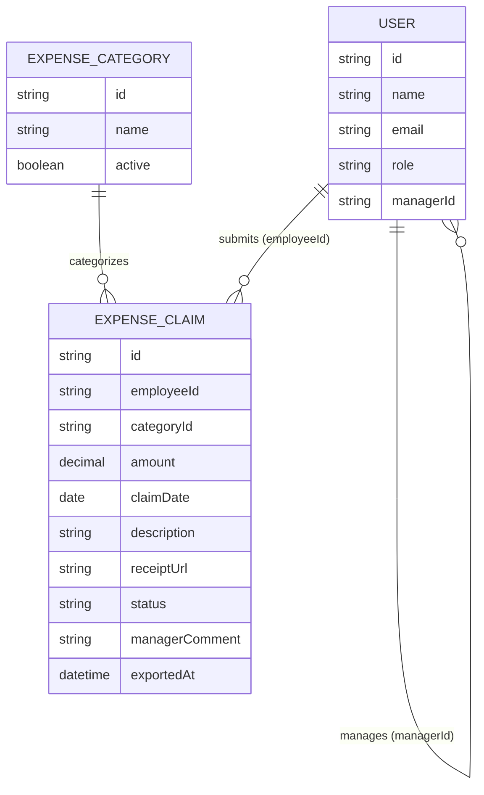
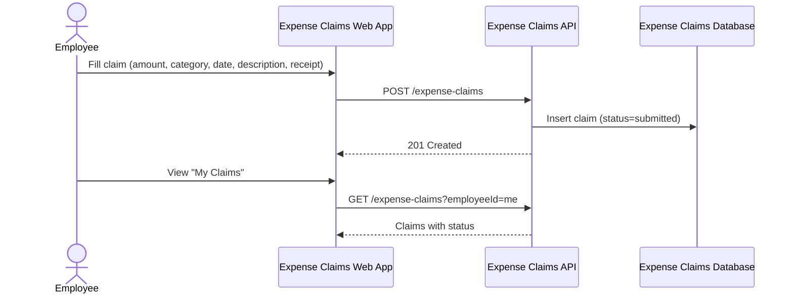
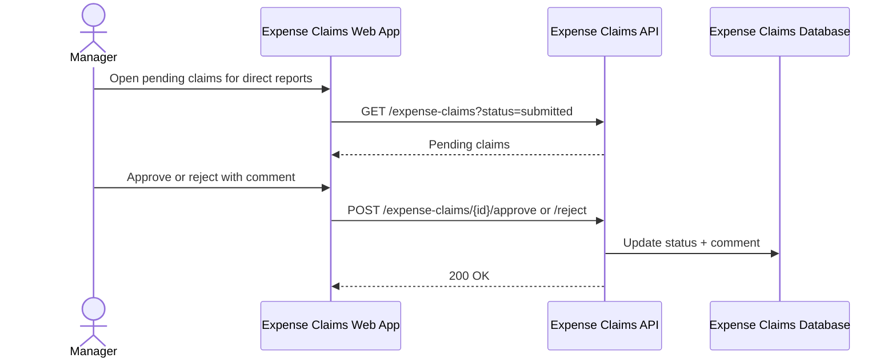
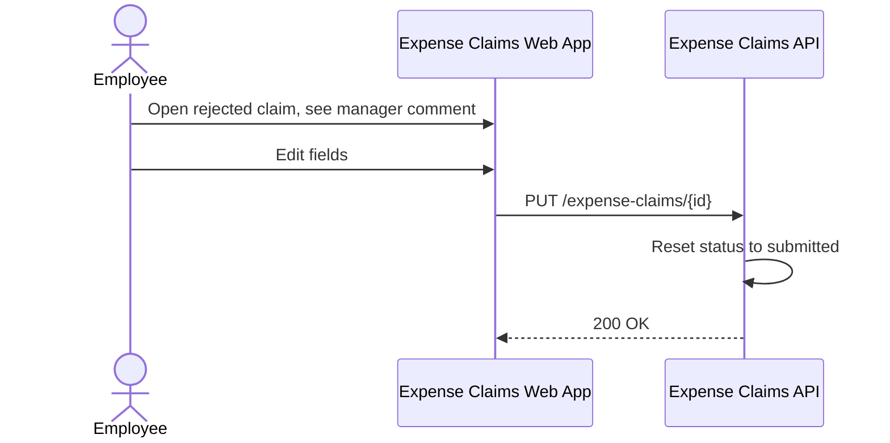
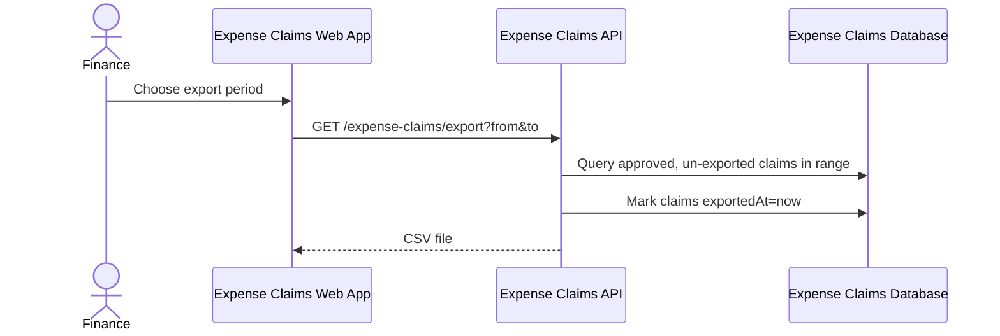
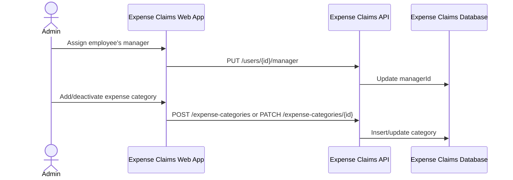

# Expense Claims — Design

One web application backed by one Ballerina service and its own database
covers the whole workflow: employees submit claims, managers approve or
reject them, finance exports approved claims to a payroll-ready file, and an
admin maintains manager assignments and the expense-category list. All four
roles sign in through Thunder, the platform identity provider, and the
service enforces role-scoped access on every operation.

## Context (C1)

## Domain model (ER)

## Key flows

### Submit and track a claim

### Manager approves or rejects a claim

### Rejected claim edited and resubmitted

### Finance exports approved claims

### Admin maintains managers and categories

